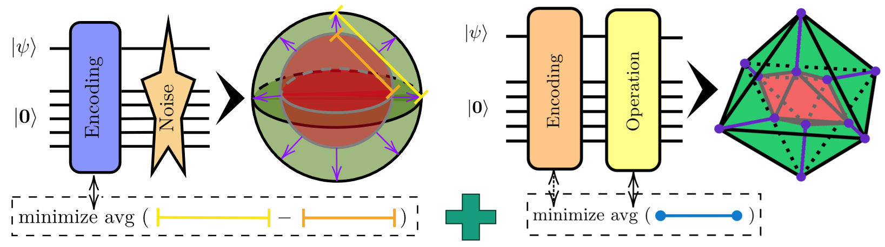

# Variational Early Fault-Tolerant Quantum Computing (VarEFTQC)

[
](https://doi.org/10.48550/arXiv.2605.28162) [](https://doi.org/10.5281/zenodo.20280560)

This repository contains the reference implementation for the framework introduced in 
[Learning Logical Operations for Arbitrary Quantum Error Correction Codes, N. Meyer et al., arXiv:2605.28162, 2026](https://arxiv.org/abs/2605.28162).

[
](https://github.com/nicomeyer96/varqec) Parts of this repository are also based on the framework previously introduced in 
[Learning Encodings by Maximizing State Distinguishability: Variational Quantum Error Correction
, N. Meyer et al., arXiv:2506.11552, 2025](https://arxiv.org/abs/2506.11552),
see the acknowledgement section for details.

> Logical operations are essential for quantum computation within quantum error-correcting codes. However, discovering 
> their physical realizations is challenging, especially for non-additive codes that lack a stabilizer description. We 
> present a general learning-based framework that, given only an encoding circuit, constructs physical implementations 
> of logical operations while enforcing structural properties such as transversality or shallow depth. Our approach is 
> validated by rediscovering known logical operations of standard stabilizer codes. We then extend it to a co-design 
> procedure, dubbed variational early fault-tolerant quantum computing (VarEFTQC), which tailors non-additive encodings 
> to a given noise model and enforces desired logical gate sets, such as transversal IQP-type families or low-depth 
> universal sets. An open-source software library provides the complete learning pipeline, including loss-function 
> variants, ansatz families, and optimization routines. Together, these results position VarEFTQC as a proof-of-concept 
> framework for discovering hardware-adapted logical gadgets for early fault-tolerant quantum computing.



---

## Setup and Installation

This project targets **Python ≥ 3.14** and uses `uv` for environment and dependency management. 
The core dependencies (see `pyproject.toml`) are:

- `pennylane == 0.43.0`
- `torch == 2.12.0`
- `openqasm3[parser] == 1.0.1`
- `gast == 0.7.0`
- `configargparse == 1.7.5`
- `tensorboard == 2.20.0`
- `tensorboardx == 2.6.5`
- `matplotlib == 3.11.1`

We recommend a **uv-based** setup:

```bash

### Install uv (if not present)
pip install uv   # or: pipx install uv

### From the project root (where pyproject.toml is located):
uv sync

### (Optional) activate the created virtual environment
source .venv/bin/activate        # Linux / macOS
.venv\Scripts\activate           # Windows
```

After that you can run

```
    uv run python examples/main.py --help
```
or, within the activated .venv, simply:
```
    python examples/main.py --help
```

---

## Using the Framework

All the modalities for the VarEFTQC procedure described in our paper are implemented in the module `src/vareftc`. Details and 
further information can be found in the respective documentation.

We also provide a script that composes the components to a fully functional training pipeline: `examples/main.py`

<details>
  <summary><b>Training Encoding</b></summary><br/>
Training encodings --e.g. ((5,2))-- as in the VarQEC framework can be done via:

```bash
python examples/main.py \
    --num_wires_data 1 --num_wires_ancilla 4 \  # set code hyperparameters
    --blocks_encoding 30 \  # encoding ansatz
    --epochs_encoding 10 \  # training epochs
    --num_validation_states 100 --num_test_states 100 \  # validation and testing (Haar-random) states
    --path ENCODING \  # path for sorting results
    --noise NOISE  # noise model
```

For possibilities to define the noise configurations please see ```src/vareftqc/helpers/parser``` or run ```python examples/main.py --help```.

The distance of the trained code can be estimated via:

```bash
python examples\main.py \
   --load_encding ENCODING \  # path to trained encoding
   --evaluate_code_distance
```

</details>

<details>
  <summary><b>Training Recovery</b></summary><br/>
Training a recovery for a given encoding as in the VarQEC framework can be done via:

```bash
python examples/main.py \
    --blocks_recovery 50 --epochs_recovery 50 \  # recovery ansatz and training epochs
    --load_encoding ENCODING \  # path to trained encoding
    --path RECOVERY \  # path for storing results
    --noise NOISE  # noise model (should be identical with the one used for training encoding)
```

The recovery operation can also be trained automatically with the encoding, 
for that just combine the arguments.

</details>

<details>
  <summary><b>Training Logical Operations</b></summary><br/>
Training a logical operation --e.g. X-- for a static encoding can be done via:

```bash
python examples\main.py \
    --encoding perfect \  # load encoding, e.g. [[5,1,3]] perfect code
    --operation_loss block \  # variant of operation loss (diag | block | full)
    --epochs_operation 10 \  # training epochs
    --operation_transversal X  # operation to train
```

The pre-implemented operations can be found in ``config/ansatz/encoding``.

There are different options to select an operation:
* ``--operation``: Loads a pre-defined operation from ``config/ansatz/operation``
* ``--operation_strictly_transversal``: Strictly transversal operation repeating the designated gate on the physical level
* ``--operation_transversal``: Standard transversal ansatz (``--repeat_operation_transversal`` for over-parameterization)
* ``--operation_weakly_transversal``: Weakly transversal ansatz (only available for two-qubit operations)
* ``--operation_non_transversal``: Non-transversal ansatz (``--blocks_operation_non_transversal`` for number of two-qubit blocks in ansatz)

Multiple of these logical operations can be combined within one training setup.

</details>

<details>
  <summary><b>Pre-Trained Models and Plotting</b></summary><br/>
We provide the pre-trained encodings and logical operations underlying Fig. 7 of the paper 
"Learning Logical Operations for Arbitrary Quantum Error Correction Codes".

The raw files can be found in `results`. 
The plots can be re-created by running
```bash
python examples/fig_7a.py
python examples/fig_7b.py
python examples/fig_7c.py
```
and are placed in `examples/plots`.

</details>

### Example: Co-Design of Encoding and IQP-Native Gate Set

Exemplarily, for training a ((5,2)) code on asymmetric depolarizing noise, that supports a transversal IQP gate set {T,CX}, 
one can run:

```bash
python examples/main.py \
    --num_wires_data 1 --num_wires_ancilla 4 \  # ((5,2)) code
    --blocks_encoding 30 --repeat_operation_transversal 3 \  # encoding and operation ansatz
    --epochs_operation 50 \  # train for 50 epochs with L-BFGS optimizer (20 internal steps)
    --operation_loss block \  # variant of operation loss (diag | block | full)
    --operation_loss_regularize 0.25 \  # weighting factor between encoding and operation loss
    --noise depolarizing --noise_strength 0.1 --noise_asymmetry 0.5 \  # define noise structure
    --operation_transversal T --operation_weakly_transversal CX \  # operations to train
    --num_test_states 100 \  # number of states to test encoding on
    --path PATH  # path to store results to
```

<details>
  <summary><b>Console Output</b></summary><br/>

During training, validation and progress information are displayed, which looks something like:
```
Set up ((5, 2)) code (trainable encoding, instance=233, parameters=(5, 3)|(30, 9)).
Set up transversal gate: `T` (1-qubit, parameters=(5, 3, 3)).
Set up weakly-transversal gate: `CX` (2-qubit, parameters=(5, 24)).

==========

Set up depolarizing noise of strength 0.1 (asymmetry c=0.5).

==========

Training encoding with transversal ['T'] operations and with weakly-transversal ['CX'] operations for 50 epochs (with up to 20 internal loops per epoch).
-----
Initializing encoding parameters uniform at random from [0, 1).
Initializing transversal T operation parameters uniform at random from [0, 1).
Initializing weakly-transversal CX operation parameters uniform at random from [0, 1).

==========

Writing results to C:\Users\meyerno\FinishedPycharmProjects\vareftqc\results\iqp (potentially overwriting).
Creating noise-free target: Set up dummy noise of strength 0.0.
Creating noisy baseline.
Creating encoding module.
Creating operation module (transversal T).
Creating operation module (weakly-transversal CX).

==========

TEST Encoding (100 Haar-random states) >>> AVG: 0.1029473 | MAX: 0.1957081 [d-loss]
TEST Baseline (100 Haar-random states) >>> AVG: 0.0872855 | MAX: 0.1839579 [d-loss]
TEST Transversal Operation `T` >>> AVG: 0.4787260 | MAX=0.9761428 [`block` o-loss]
TEST Transversal Operation `CX` >>> AVG: 0.2519694 | MAX=0.9983340 [`block` o-loss]
TRAIN #1/50 (loop #1) Encoding >>> AVG: 0.0994961 | MAX: 0.1943019 [d-loss]
TRAIN #1/50 (loop #1) Transversal Operation `T` >>> AVG: 0.4787260 | MAX=0.9761428 [`block` o-loss]
TRAIN #1/50 (loop #1) Weakly-Transversal Operation `CX` >>> AVG: 0.2519694 | MAX=0.9983340 [`block` o-loss]
TRAIN #1/50 (loop #1) Encoding + Operations >>> AVG: 0.2821699 | MAX: 0.6879211 [d-loss + 0.25 * Σ o-loss]
TRAIN #1/50 (loop #2) Encoding >>> AVG: 0.0990694 | MAX: 0.1933268 [d-loss]
TRAIN #1/50 (loop #2) Transversal Operation `T` >>> AVG: 0.4784852 | MAX=0.9755454 [`block` o-loss]
TRAIN #1/50 (loop #2) Weakly-Transversal Operation `CX` >>> AVG: 0.2519770 | MAX=0.9983488 [`block` o-loss]
TRAIN #1/50 (loop #2) Encoding + Operations >>> AVG: 0.2816850 | MAX: 0.6868004 [d-loss + 0.25 * Σ o-loss]
[...]
TRAIN #50/50 (loop #1) Encoding >>> AVG: 0.0535071 | MAX: 0.0955706 [d-loss]
TRAIN #50/50 (loop #1) Transversal Operation `T` >>> AVG: 0.0000001 | MAX=0.0000002 [`block` o-loss]
TRAIN #50/50 (loop #1) Weakly-Transversal Operation `CX` >>> AVG: 0.0000002 | MAX=0.0000008 [`block` o-loss]
TRAIN #50/50 (loop #1) Encoding + Operations >>> AVG: 0.0535072 | MAX: 0.0955709 [d-loss + 0.25 * Σ o-loss]
TEST Encoding (100 Haar-random states) >>> AVG: 0.0557460 | MAX: 0.0945713 [d-loss]
TEST Baseline (100 Haar-random states) >>> AVG: 0.0872855 | MAX: 0.1839579 [d-loss]
TEST Transversal Operation `T` >>> AVG: 0.0000001 | MAX=0.0000002 [`block` o-loss]
TEST Transversal Operation `CX` >>> AVG: 0.0000002 | MAX=0.0000008 [`block` o-loss]
Stored logging file to C:\Users\meyerno\FinishedPycharmProjects\vareftqc\results\iqp\logs.pkl.
Stored encoding file to C:\Users\meyerno\FinishedPycharmProjects\vareftqc\results\iqp\encoding.qasm.
Stored `T` transversal operation file to C:\Users\meyerno\FinishedPycharmProjects\vareftqc\results\iqp\T_transversal.qasm.
Stored `CX` weakly-transversal operation file to C:\Users\meyerno\FinishedPycharmProjects\vareftqc\results\iqp\CX_weakly_transversal.qasm.
Stored encoding properties file to C:\Users\meyerno\FinishedPycharmProjects\vareftqc\results\iqp\encoding_properties.pkl.
Stored encoding parameters file to C:\Users\meyerno\FinishedPycharmProjects\vareftqc\results\iqp\encoding_parameters.pkl.
Stored transversal T operation properties file to C:\Users\meyerno\FinishedPycharmProjects\vareftqc\results\iqp\T_transversal_properties.pkl.
Stored transversal T operation parameters file to C:\Users\meyerno\FinishedPycharmProjects\vareftqc\results\iqp\T_transversal_parameters.pkl.
Stored weakly-transversal CX operation properties file to C:\Users\meyerno\FinishedPycharmProjects\vareftqc\results\iqp\CX_weakly_transversal_properties.pkl.
Stored weakly-transversal CX operation parameters file to C:\Users\meyerno\FinishedPycharmProjects\vareftqc\results\iqp\CX_weakly_transversal_parameters.pkl.
```

</details>

The results of the procedure are stored to `results/PATH`. Re-training and finetuning can be done by loading the ansätze via
``--load_encoding PATH``, ``--load_operation_transversal PATH/T``, and ``--load_operation_weakly_transversal PATH/CX``.

Logging via Tensorboard can be activated by ``--tensorboard``.

To allow for reproducible results, as the initial ansatz is constructed randomly, one can also set a seed via
`--seed SEED`.

> **Note on Reproducibility:** <br/>
> The seed fixes the construction of the circuit ansätze, the initial parameters, and the Haar-random states for validation.
> However, the training procedure itself (realized by the L-BFGS optimizer) might lead to small deviations, especially
> across different operating systems. However, in practice it anyway usually is a good idea to train multiple VarQEC codes
> with varying seeds and select the best performing one.

> **Notes on Paper Results:** <br/>
> The trained encoding and logical gadgets from the paper are also available here: 
> [https://zenodo.org/records/20280560](https://zenodo.org/records/20280560)

---

## Acknowledgements

We gratefully acknowledge the scientific support and HPC resources provided by the Erlangen 
[National High Performance Computing Center (NHR@FAU)](https://hpc.fau.de/) of the 
Friedrich-Alexander-Universität Erlangen-Nürnberg (FAU). The hardware is funded by the German Research Foundation (DFG).

**Funding:**  
The research was supported by the German Federal Ministry of Research, Technology and Space, funding program 
*Quantum Systems*, via the project [**Q‑GeneSys**](https://www.iis.fraunhofer.de/de/ff/lv/dataanalytics/anwproj/q-genesys.html), grant number **13N17389**. 
It is also part of the **Munich Quantum Valley (MQV)** initiative, which is supported by the Bavarian state government 
with funds from the Hightech Agenda Bayern Plus.

**Relation to VarQEC:**  
This codebase **extends** the earlier [*VarQEC* project](https://github.com/nicomeyer96/varqec). In particular, the 
encoding-learning part is refactored and generalized in the `Encoding Module` and associated helpers, while the extension
for learning logical operations is integrated via `OperationTargetModule` and `OperationPredictionModule`.

## Citation

If you use this implementation or results from the paper (VarEFTQC), please cite:

```bibtex
@article{meyer2026logical,
  title   = {Learning Logical Operations for Arbitrary Quantum Error Correction Codes},
  author  = {Meyer, Nico and Mutschler, Christopher and Seu{\ss}, Dominik and Maier, Andreas and Scherer, Daniel D.},
  journal = {arXiv:2605.28162},
  year    = {2026}
}
```

If you use the underlying approach for learning encodings (VarQEC), please also cite:

```bibtex
@article{meyer2025learning,
  title   = {Learning Encodings by Maximizing State Distinguishability: Variational Quantum Error Correction},
  author  = {Meyer, Nico and Mutschler, Christopher and Maier, Andreas and Scherer, Daniel D.},
  journal = {arXiv:2506.11552},
  year    = {2025}
}
```

## License

This project is licensed under the **Apache 2.0 License**.
